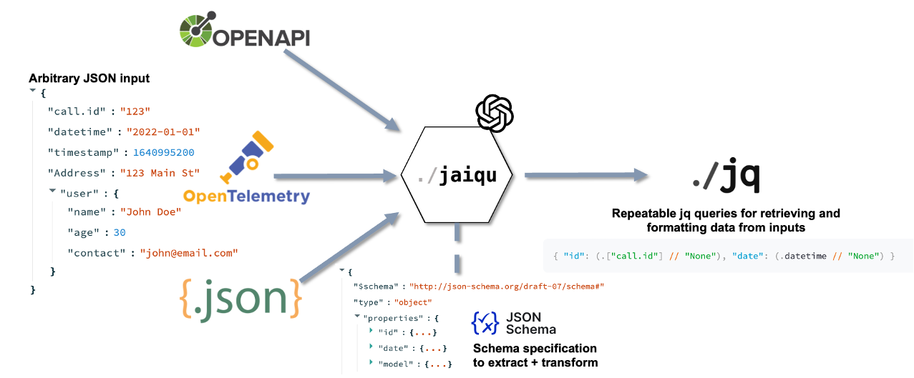

# Jaiqu

[](https://opensource.org/licenses/MIT) 
[](https://x.com/agentopsai)

Replicable, AI-generated JSON transformation queries. Transform any JSON into any schema automatically.

Jaiqu is an AI agent for creating repeatable JSON transforms using [jq query language](https://jqlang.github.io/jq/) syntax. Jaiqu translates any arbitrary JSON inputs into any desired schema.

Building AI agents? Check out [AgentOps](https://agentops.ai/?jaiqu)



### Features
* **Translate any schema to any schema** AI agent automatically maps data from a source schema to a desired format by iteratively prompting GPT-4 to create valid jq query syntax.
* **Schema validation** Given a requirement schema, automatically validate whether the required data is present in the input json.
* **Fuzzy term matching** Infers keys based on symantic similarity (i.e. datetime vs date_time). GPT-4 automaticlaly maps and translates input keys to desired output keys.

### Example usage:

```python
from jaiqu import validate_schema, translate_schema

# Desired data format 
schema = {
    "$schema": "http://json-schema.org/draft-07/schema#",
    "type": "object",
    "properties": {
        "id": {
            "type": ["string", "null"],
            "description": "A unique identifier for the record."
        },
        "date": {
            "type": "string",
            "description": "A string describing the date."
        },
        "model": {
            "type": "string",
            "description": "A text field representing the model used."
        }
    },
    "required": [
        "id",
        "date"
    ]
}

# Provided data
input_json = {
    "call.id": "123",
    "datetime": "2022-01-01",
    "timestamp": 1640995200,
    "Address": "123 Main St",
    "user": {
        "name": "John Doe",
        "age": 30,
        "contact": "john@email.com"
    }
}

# (Optional) Create hints so the agent knows what to look for in the input
key_hints="We are processing outputs of an containing an id, a date, and a model. All the required fields should be present in this input, but the names might be different."
```

Validating an input json contains all the information required in a schema
```python
schema_properties, valid = validate_schema(input_json, schema, key_hints)

print(schema_properties)

>>> {
      "id": {
          "identified": true,
          "key": "call.id",
          "message": "123",
          "type": [
          "string",
          "null"
          ],
          "description": "A unique identifier for the record.",
          "required": true
      },
      "date": {
          "identified": true,
          "key": "datetime",
          "message": "2022-01-01",
          "type": "string",
          "description": "A string describing the date."
          "required": true
      }
    }
print(valid)
>>> True
```

Creating a repeatable jq query for extracitng data from identically formatted input JSONs
```python
jq_query = jaiqu.translate_schema(input_json, schema, key_hints, max_retries=30)
>>>'{"id": .attributes["call.id"], "date": .datetime}'
```

## Installation

#### Recommended: [PyPI](https://pypi.org/project/jaiqu/):

```bash
pip install jaiqu
```


## Architecture
Unraveling the Jaiqu agentic workflow pattern 


## Running tests

0. Install `pytest` if you don't have it already

```shell
pip install pytest
```

1. Run the `tests/` folder while in the parent directory

```shell
pytest tests
```

This repo also supports `tox`, simply run `python -m tox`.

## Contributing

Contributions to Jaiqu are welcome! Feel free to create an [issue](https://github.com/AgentOps-AI/jaiqu/issues) for any bug reports, complaints, or feature suggestions.

## License

Jaiqu is released under the MIT License.
